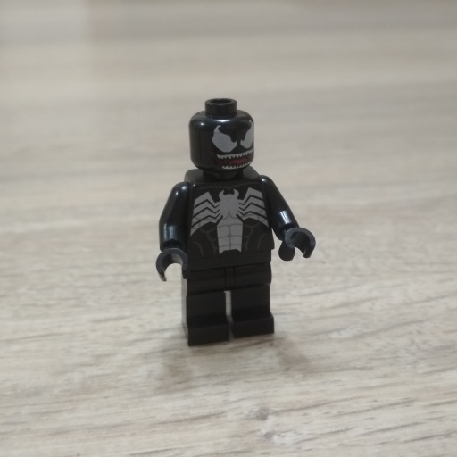
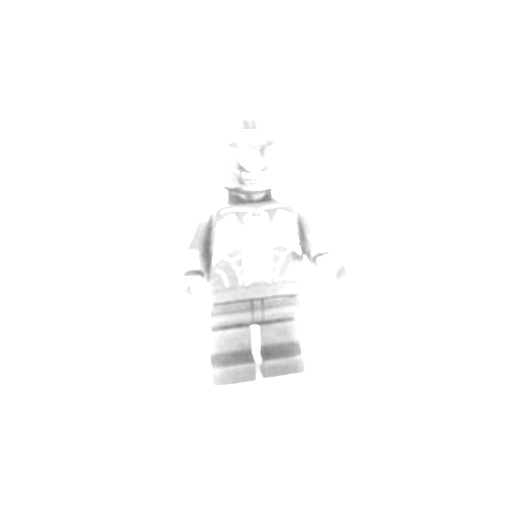
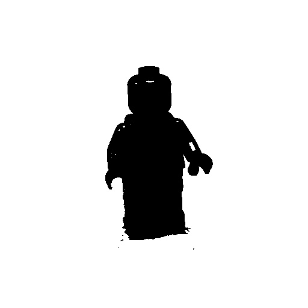

#   Image Processing

## Description
In this repository are the python files where many of the image matrix operations are implemented along with a main python file where all of these operations are executed on a root image and then produces all the transformed images. 

## Main Learnings 
* Read images matrix 
* Implementation of the main image matrix operations (Padding, Convolusion, Gray Scale and Black & White)
* Producing new images from a root image

## Installation
* Make sure to have installed python and pip
* Download the repository on your local machine
* Open a terminal and locate it at the project root path 
* Run the command <code>pip install opencv-python</code> and <code>pip install numpy</code>
* Now you can run the main python file <code>imagenmain.py</code> where all the transformated images are produced from the root image

## Screenshots

    
